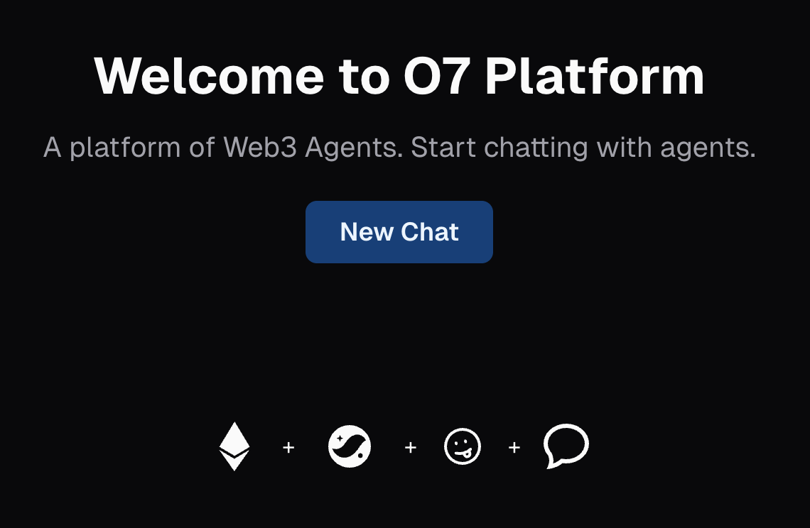
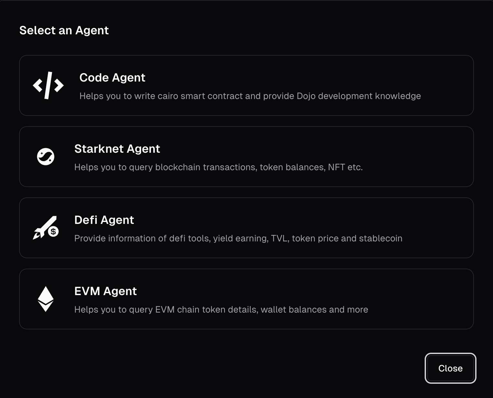

# O7 Web3 Agent Platform

An Open-Source Web3 Agent Platform to interact with Starknet and EVM chains. O7 enables you to chat with intelligent agents, interact with blockchain data, and leverage AI-powered tools for Web3 development and research.

Watch [youtube demo] (https://youtu.be/s6qmXYIFLcY)



---

## 🚀 Features

- **Composable Design**: Flexible to conigure new agents, to support new MCP servers.
- **Multi-Agent Chat**: Converse with specialized agents for Starknet, EVM, DeFi, and code generation.
- **Blockchain Data**: Query token prices, wallet balances, NFTs, DeFi pools, TVL, and more.
- **Smart Contract Coding**: Generate and edit Cairo smart contracts, get Dojo development guidance.
- **Multi LLM Support**: Support 20+ LLM models incllude Gemini, OpenAI, Anthropic, Deepseek, and [more](https://ai-sdk.dev/docs/foundations/providers-and-models#ai-sdk-providers)
- **Authentication**: Secure login and registration with Supabase Auth.
- **Modern UI**: Responsive, dark/light theme, and intuitive sidebar navigation.
- **Weather Tool**: Get real-time weather info via chat.

---

## 📸 Screenshots

### General

#### Select an agent to start a chat



#### Mutiple LLM model support


#### Ask agent about supported tools


#### View LLM response source option


#### Code Agent

##### Ask the agent to help write a simple Cairo contract


##### Ask about Dojo Development


#### Starknet Agent

##### Query token


##### Lookup Starknet ID


#### EVM Agent

##### Query NFT Balance


#### Defi Agent

##### Ask about TVL


and much more!! see below supported MCP and features

---

## 🧩 Supported Features

| Agent      | MCP Server  | MCP Repository                 | Supported Features                                                                                                                                                                                              |
| ---------- | ----------- | ------------------------------ | --------------------------------------------------------------------------------------------------------------------------------------------------------------------------------------------------------------- |
| Code Agent | Cairo Coder | `@kasarlabs/cairo-coder-mcp`   | `assist_with_cairo`: Provides AI-powered assistance for Cairo and Starknet development tasks, including writing, refactoring, implementing, or completing Cairo code, and understanding the Starknet ecosystem. |
| Code Agent | Dojo Sensei | `github:dojoengine/sensei-mcp` |

- `dojo_101`: Offers a beginner-friendly introduction to Dojo development, covering basic workflows and high-level overviews.<br>
- `dojo_config`: Provides essential guidance for configuring Dojo projects, including Scarb.toml setup, profile files, permissions, namespaces, and dependency management.<br>
- `dojo_logic`: Offers expert guidance on implementing Dojo systems and game logic, such as writing contract functions, implementing game mechanics, handling state changes, and interacting with the World contract.<br>
- `dojo_model`: Specializes in guidance for creating and working with Dojo models, including defining data structures, creating model schemas, and understanding model relationships.<br>
- `dojo_sensei`: Serves as the main system prompt for comprehensive guidance across all aspects of Dojo and Cairo development.<br>
- `dojo_test`: Provides a comprehensive guide for writing tests for Dojo applications, including unit tests, integration tests, and setting up test environments.<br>
- `dojo_token`: Offers detailed guidance on implementing token standards in Dojo, such as ERC20, ERC721, and ERC1155 tokens. |

---

| Agent          | MCP Server   | MCP Repository                      | Supported Features |
| -------------- | ------------ | ----------------------------------- | ------------------ |
| Starknet Agent | Starknet MCP | `@mcpdotdirect/starknet-mcp-server` |

- `get_starknet_chain_info`: Get information about a Starknet network.<br>
- `get_supported_starknet_networks`: Get a list of supported Starknet networks.<br>
- `get_starknet_eth_balance`: Get the ETH balance for a Starknet address or Starknet ID.<br>
- `get_starknet_token_balance`: Get the token balance for a Starknet address or Starknet ID.<br>
- `get_starknet_strk_balance`: Get the STRK token balance for a Starknet address or Starknet ID.<br>
- `get_starknet_native_balances`: Get all native token balances (ETH and STRK) for a Starknet address or Starknet ID.<br>
- `resolve_starknet_name`: Get the Starknet ID for an address.<br>
- `resolve_starknet_address`: Get the address for a Starknet ID.<br>
- `get_starknet_profile`: Get the full Starknet ID profile for an address or Starknet ID.<br>
- `validate_starknet_domain`: Check if a string is a valid Starknet ID.<br>
- `get_starknet_block`: Get information about a specific block.<br>
- `get_starknet_block_transactions`: Get transactions in a specific block.<br>
- `get_starknet_transaction`: Get details about a transaction.<br>
- `get_starknet_transaction_receipt`: Get transaction receipt.<br>
- `call_starknet_contract`: Call a read-only function on a contract.<br>
- `get_starknet_contract_class`: Get the class (ABI and other information) of a contract.<br>
- `get_starknet_token_info`: Get information about a token.<br>
- `check_starknet_nft_ownership`: Check if an address owns a specific NFT.<br>
- `get_starknet_nft_balance`: Get the number of NFTs owned by an address for a specific collection.<br>
- `get_starknet_token_supply`: Get the total supply of a token.<br>
- `check_starknet_transaction_status`: Check if a transaction is confirmed (finalized).<br>
- `transfer_starknet_eth`: Transfer ETH from one account to another.<br>
- `transfer_starknet_strk`: Transfer STRK from one account to another.<br>
- `transfer_starknet_token`: Transfer ERC20 tokens from one account to another.<br>
- `execute_starknet_contract`: Execute a contract call (write operation). |

---

| Agent     | MCP Server | MCP Repository                 | Supported Features |
| --------- | ---------- | ------------------------------ | ------------------ |
| EVM Agent | EVM Agent  | `@mcpdotdirect/evm-mcp-server` |

- `get_chain_info`: Get information about an EVM network.<br>
- `resolve_ens`: Resolve an ENS name to an Ethereum address.<br>
- `get_supported_networks`: Get a list of supported EVM networks.<br>
- `get_block_by_number`: Get a block by its block number.<br>
- `get_latest_block`: Get the latest block from the EVM.<br>
- `get_balance`: Get the native token balance (ETH, MATIC, etc.) for an address.<br>
- `get_erc20_balance`: Get the ERC20 token balance of an Ethereum address.<br>
- `get_token_balance`: Get the balance of an ERC20 token for an address.<br>
- `get_transaction`: Get detailed information about a specific transaction by its hash. Includes sender, recipient, value, data, and more.<br>
- `get_transaction_receipt`: Get a transaction receipt by its hash.<br>
- `estimate_gas`: Estimate the gas cost for a transaction.<br>
- `transfer_eth`: Transfer native tokens (ETH, MATIC, etc.) to an address.<br>
- `transfer_erc20`: Transfer ERC20 tokens to another address.<br>
- `approve_token_spending`: Approve another address (like a DeFi protocol or exchange) to spend your ERC20 tokens. This is often required before interacting with DeFi protocols.<br>
- `transfer_nft`: Transfer an NFT (ERC721 token) from one address to another. Requires the private key of the current owner for signing the transaction.<br>
- `transfer_erc1155`: Transfer ERC1155 tokens to another address. ERC1155 is a multi-token standard that can represent both fungible and non-fungible tokens in a single contract.<br>
- `transfer_token`: Transfer ERC20 tokens to an address.<br>
- `is_contract`: Check if an address is a smart contract or an externally owned account (EOA).<br>
- `get_token_info`: Get comprehensive information about an ERC20 token including name, symbol, decimals, total supply, and other metadata. Use this to analyze any token on EVM chains.<br>
- `get_token_balance_erc20`: Get ERC20 token balance for an address.<br>
- `get_nft_info`: Get detailed information about a specific NFT (ERC721 token), including collection name, symbol, token URI, and current owner if available.<br>
- `check_nft_ownership`: Check if an address owns a specific NFT.<br>
- `get_erc1155_token_uri`: Get the metadata URI for an ERC1155 token (multi-token standard used for both fungible and non-fungible tokens). The URI typically points to JSON metadata about the token.<br>
- `get_nft_balance`: Get the total number of NFTs owned by an address from a specific collection. This returns the count of NFTs, not individual token IDs.<br>
- `get_erc1155_balance`: Get the balance of a specific ERC1155 token ID owned by an address. ERC1155 allows multiple tokens of the same ID, so the balance can be greater than 1.<br>
- `get_address_from_private_key`: Get the EVM address derived from a private key. |

---

| Agent      | MCP Server | MCP Repository                | Supported Features |
| ---------- | ---------- | ----------------------------- | ------------------ |
| Defi Agent | Defi Agent | `github:0xbohu/defillama-mcp` |

- `defillama_get_protocols`: This tool lists all protocols tracked by DefiLlama.<br>
- `defillama_get_protocol_tvl`: This tool gets TVL (Total Value Locked) data for a specific protocol.<br>
- `defillama_get_chain_tvl`: This tool gets TVL (Total Value Locked) data for a specific chain.<br>
- `defillama_get_token_prices`: This tool gets current prices of tokens.<br>
- `defillama_get_historical_prices`: This tool gets historical prices of tokens at a specified timestamp.<br>
- `defillama_get_stablecoins`: This tool lists all stablecoins tracked by DefiLlama.<br>
- `defillama_get_stablecoin_data`: This tool gets data for a specific stablecoin. |

---

## 🛠️ Installation

1. **Clone the repository:**
   ```bash
   git clone https://github.com/0xbohu/o7-agent.git
   cd o7-agent
   ```
2. **Install dependencies:**
   ```bash
   pnpm install
   # or
   npm install
   # or
   yarn install
   ```
3. **Set up environment variables:**
   - Copy `.envexample` to `.env.local` and fill in your API keys:
     ```bash
     cp .envexample .env.local
     ```
   - Required variables:
     - `NEXT_PUBLIC_SUPABASE_URL`
     - `NEXT_PUBLIC_SUPABASE_ANON_KEY`
     - `OPENAI_API_KEY`
     - `ANTHROPIC_API_KEY`
     - `GOOGLE_GENERATIVE_AI_API_KEY`
     - `DEEPSEEK_API_KEY`, `DEEPSEEK_API_URL`, etc.

4. **Run the development server:**
   ```bash
   pnpm dev
   # or
   npm run dev
   # or
   yarn dev
   ```
   The app will be available at [http://localhost:3001](http://localhost:3001)

---

## 📦 Usage

- Start a new chat with an agent (Starknet, EVM, DeFi, Code, etc.).
- Query blockchain data, generate smart contracts, or collaborate on documents.
- Upload files for AI-powered summarization and extraction.
- Use the sidebar to navigate chat history, documents, and settings.

---

## ⚙️ Environment Variables

See `.envexample` for all required variables. Main ones include:

```env
NEXT_PUBLIC_SUPABASE_URL=your_supabase_url
NEXT_PUBLIC_SUPABASE_ANON_KEY=your_supabase_anon_key
OPENAI_API_KEY=your_openai_key
ANTHROPIC_API_KEY=your_anthropic_key
GOOGLE_GENERATIVE_AI_API_KEY=your_gemini_key
DEEPSEEK_API_KEY=your_deepseek_key
DEEPSEEK_API_URL=https://api.deepseek.com
```

---

## 🗳️ Supabase DB Migration

Run `.sql` files in `./supabase/migrations`

---

## 🤝 Contributing

Contributions are welcome! Please open issues or pull requests for new features, bug fixes, or documentation improvements.

---

## 📄 License

This project is licensed under the [MIT License](LICENSE).
